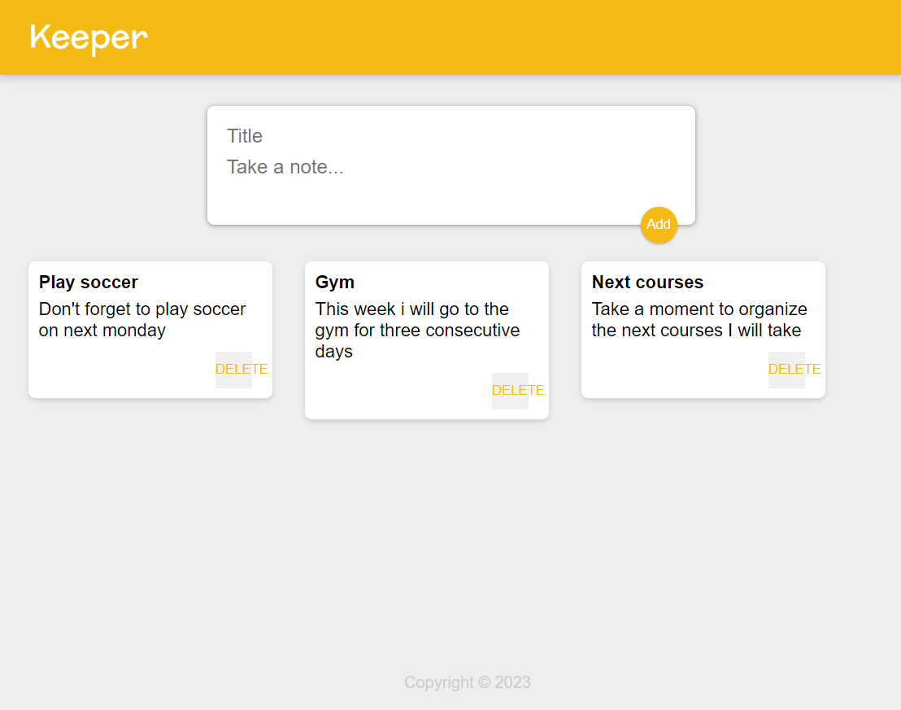

# Keeper App

*A basic clone version of the Google Keep app*

This project was made for practice the following skills:

- React components, props and useState Hooks
- ES6 destructuring and spread operator
- map and filter functions
- Material UI

*Hope you enjoy it* 🙃  
*Feel free to open an issue or PR and contribute with the project* ❤️ 
